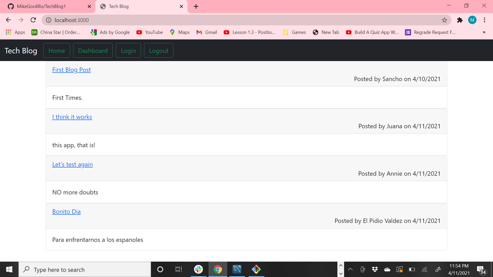

# TechBlog1

        
## Name:Fidel Bello, Lucas Diaz, Robert Vanscoy, Fransisco Ortega, Mike Gordillo
## GitHub user name: Movie_Profile_App

## Table of contents:  
* [Description](#description)
* [Installation](#Installation)
* [Usage](#usage)
* [License](#license)
* [Testing](#testing)
* [Questions](#questions)
        
## Description:
* This is a Blog/Posts App for a user to create a profile and make comments and post and update them. The comments are saved to a Mysql dadabase to the specific user profile to ater retrieve and update the comments/posts. The user will be able to view previous comments by other users and the times and date, at which the posts where made.
## Installation:
* Download all the files in this repository, then npm i and run start.
## Usage:
* Create a profile, see the other comments posted to the homepage, create your own user profile to chime in and post your own.
## license:
* None
        
## Contributing:
* Yes, fork the repo and create a pull request for merging.
## Testing:
* no tests
## Questions:
* Contact  Mike Gordillo with any questions at mikegordillotattoo@gmail.com

https://github.com/MikeGordillo/TechBlog1

      